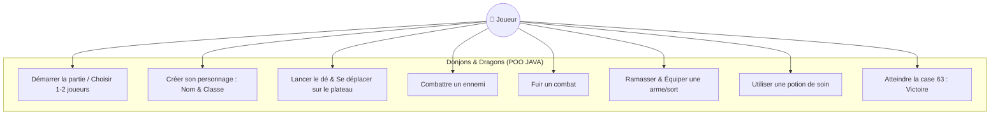
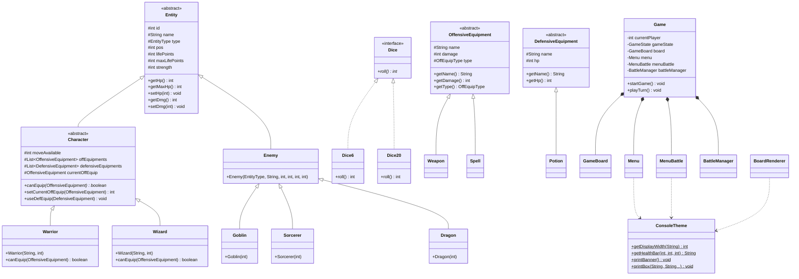

# POO_JAVA — Jeu de plateau

Jeu de plateau textuel en Java, jouable à 1 ou 2 joueurs dans la console avec une **Interface Terminal Moderne (TUI / ANSI)**.
Chaque joueur avance sur un plateau de 63 cases à coups de dé, ramasse de l'équipement,
affronte les ennemis rencontrés et tente d'atteindre la dernière case en restant en vie.

Projet réalisé dans le cadre du cours de Programmation Orientée Objet (POO).

---

## 🎨 Interface Console Moderne (TUI / ANSI)

Le jeu intègre un moteur de rendu graphique console développé sur mesure (`ConsoleTheme.java` & `BoardRenderer.java`) :
- **Bannière ASCII Art** au lancement de l'application.
- **Cartes de statut & d'arène encadrées** avec alignement strict des bordures au millimètre.
- **Jauges de santé dynamiques** avec dégradés de couleur (`[██████████] 8/8 HP`).
- **Grille de plateau compacte (Case 1 à 63)** avec icônes et codes à 2 lettres (`[⚔️J1]`, `[🐉DR]`, `[👺GB]`, `[🔮SO]`, `[🧪PT]`, `[🗡️EP]`, `[🔨MA]`, `[✨FE]`, `[✨EC]`).

---

## 🗺️ Cas d'utilisation (Use Case UML)



---

## 📐 Diagramme de Classes (UML)



---

## 🛠️ Prérequis

- **JDK 17 ou supérieur** (ex: JDK 17 / JDK 21 / JDK 25).
- Aucune dépendance externe obligatoire pour jouer. Les JARs présents dans `lib/` (MySQL Connector) ne servent qu'à la persistance optionnelle.

---

## 🚀 Lancer le jeu

### Depuis IntelliJ IDEA :
Ouvrir le projet et exécuter la classe `fr.campus.poojava.Main`.

### En ligne de commande (PowerShell / Terminal) :

Depuis la racine du projet :

```bash
# Compilation avec encodage UTF-8 vers out/production/POO_JAVA
javac --release 17 -encoding UTF-8 -d out/production/POO_JAVA (Get-ChildItem -Recurse -Filter *.java src).FullName

# Exécution de l'application avec support UTF-8
java -D"file.encoding=UTF-8" -cp out/production/POO_JAVA fr.campus.poojava.Main
```

---

## 📁 Structure du projet (Clean Architecture & Packaging par Domaine)

```
src/fr/campus/poojava/
├── Main.java                          Point d'entrée principal
├── db/
│   └── Database.java                  Persistance MySQL (via variables d'environnement)
├── entity/
│   ├── Entity.java                    Classe abstraite de base (id, name, type, hp, maxHp, dmg, pos)
│   ├── EntityType.java                Enum des types (WARRIOR, WIZARD, GOBLIN, SORCERER, DRAGON)
│   ├── character/
│   │   ├── Character.java             Classe abstraite du héros
│   │   ├── Warrior.java               Guerrier (PV:10, DMG:5)
│   │   └── Wizard.java                Mage (PV:7, DMG:7)
│   └── enemies/
│       ├── Enemy.java                 Classe de base des ennemis
│       ├── Goblin.java                Ennemi Goblin
│       ├── Sorcerer.java              Ennemi Sorcier (Sorcerer)
│       └── Dragon.java                Ennemi Dragon
├── equipment/
│   ├── defensive/
│   │   ├── DefensiveEquipment.java   Classe abstraite des équipements défensifs
│   │   ├── DefEquip.java              Enum des potions
│   │   └── potion/
│   │       ├── Potion.java            Classe abstraite des potions
│   │       ├── PotionHP.java          Potion standard (+2 HP)
│   │       └── BigPotionHP.java       Grande potion (+5 HP)
│   └── offensive/
│       ├── OffensiveEquipment.java   Classe abstraite des équipements offensifs
│       ├── OffEquip.java              Enum (SWORD, MACE, LIGHTNING, FIREBALL)
│       ├── OffEquipType.java          Enum (WEAPON, SPELL)
│       ├── spell/
│       │   ├── Spell.java             Classe abstraite des sorts
│       │   ├── FireBall.java          Sort Boule de Feu
│       │   └── ThunderBolt.java       Sort Éclair
│       └── weapon/
│           ├── Weapon.java            Classe abstraite des armes
│           ├── Mace.java              Massue
│           └── Sword.java             Épée
├── game/
│   ├── Game.java                      Boucle principale et machine à états (~250 lignes)
│   ├── GameState.java                 Enum des états du jeu
│   ├── board/
│   │   ├── GameBoard.java             Gestionnaire du plateau 63 cases
│   │   └── Cell.java                  Case du plateau
│   ├── battle/
│   │   ├── BattleManager.java         Gestionnaire des combats itératif
│   │   ├── BattleState.java           Enum des états de combat
│   │   └── Crit.java                  Enum des coups critiques
│   └── dice/
│       ├── Dice.java                  Interface des dés
│       ├── Dice6.java                 Dé 6 faces
│       └── Dice20.java                Dé 20 faces
└── ui/
    ├── ConsoleTheme.java              Gestion des thèmes ANSI, calculs de bordures Unicode & jauges de vie
    ├── Menu.java                      Gestion des entrées/sorties utilisateur et inventaires
    ├── BoardRenderer.java             Rendu graphique du plateau console et fiches de statut
    └── MenuBattle.java                Cartes d'affrontement et bannières de combat
```

---

## 🌟 Points Forts du Projet

1. **Rendu Console ANSI Moderne** : Design soigné avec cartes d'information encadrées, jauges de vie et grille de plateau parfaitement alignée.
2. **Homogénéité Linguistique** : Code source 100% propre et cohérent en anglais (`Sorcerer`, `SWORD`, `LIGHTNING`, `FIREBALL`).
3. **Domain Packaging (`game.board`, `game.battle`)** : Organisation modulaire par domaine d'activité.
4. **Découplage UI** : Séparation claire entre la logique métier (`game`) et la couche de présentation (`ui`).
5. **Fichiers compacts (< 300 lignes)** : Code source maintenable, lisible et fortement découplé.
