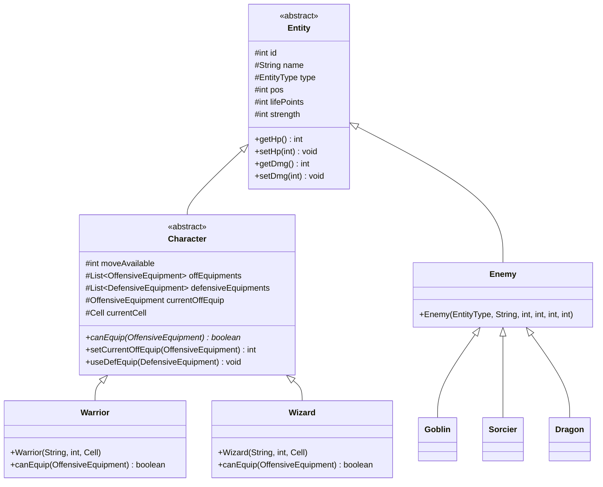

# POO_JAVA — Jeu de plateau

Jeu de plateau textuel en Java, jouable à 1 ou 2 joueurs dans la console.
Chaque joueur avance sur un plateau de 63 cases à coups de dé, ramasse de l'équipement,
affronte les ennemis rencontrés et tente d'atteindre la dernière case en restant en vie.

Projet réalisé dans le cadre du cours de Programmation Orientée Objet (POO).

---

## Prérequis

- **JDK 17 ou supérieur** (ex: JDK 21 / JDK 25).
- Aucune dépendance externe obligatoire pour jouer. Les JARs présents dans `lib/` (MySQL Connector) ne servent qu'à la persistance optionnelle.

---

## Lancer le jeu

### Depuis IntelliJ IDEA :
Ouvrir le projet et exécuter la classe `fr.campus.poojava.Main`.

### En ligne de commande :

Depuis la racine du projet :

```bash
# Compilation avec encodage UTF-8 vers out/production/POO_JAVA
javac -encoding UTF-8 -d out/production/POO_JAVA (Get-ChildItem -Recurse -Filter *.java src).FullName

# Exécution de l'application
java -cp out/production/POO_JAVA fr.campus.poojava.Main
```

---

## Règles du jeu

- **Plateau de 63 cases** : Tous les joueurs démarrent à la case 0 ; atteindre la dernière case met fin à la partie.
- **1 à 2 joueurs** : Chaque joueur choisit sa classe et son nom au lancement.
- **Tour de jeu** : À son tour, un joueur lance un dé (1 à 6) puis avance case par case en validant chaque étape.
- **Contenu du plateau** :
  - **24 ennemis** (Goblin, Sorcier, Dragon)
  - **16 équipements offensifs** (Massue, Épée, Éclair, Boule de Feu)
  - **8 potions** (Potion Standard, Grande Potion)
- **Victoire / Mort** :
  - Ramasser un équipement l'ajoute à l'inventaire.
  - Rencontrer un ennemi déclenche un combat tour par tour.
  - Un joueur dont les PV tombent à 0 ou moins meurt et est retiré du plateau. La partie se termine si tous les joueurs meurent ou si l'un d'eux atteint la fin.

---

### Classes jouables & Équipements

| Classe   | PV  | Force | Équipement utilisable |
|----------|-----|-------|-----------------------|
| Guerrier | 10  | 5     | Armes (Massue, Épée)  |
| Mage     | 7   | 7     | Sorts (Éclair, Boule de Feu) |

> **Polymorphisme** : Un Guerrier ne peut équiper que des Armes, tandis qu'un Mage ne peut équiper que des Sorts. L'aptitude d'équipement est vérifiée de façon polymorphique (`canEquip`).

---

### Ennemis

| Ennemi  | PV  | Dégâts |
|---------|-----|--------|
| Goblin  | 6   | 1      |
| Sorcier | 9   | 2      |
| Dragon  | 15  | 4      |

---

## Structure du projet

Le projet respecte les conventions de nommage Java (`fr.campus.poojava`) et les principes de la POO :

```
src/fr/campus/poojava/
├── Main.java                          Point d'entrée standard (public static void main)
├── db/
│   └── Database.java                  Persistance MySQL (sécurisée par variables d'environnement)
├── entity/
│   ├── Entity.java                    Classe abstraite de base (id, name, type, hp, dmg, pos)
│   ├── EntityType.java                Enumération des types d'entités (GUERRIER, MAGE, etc.)
│   ├── character/
│   │   ├── Character.java             Classe abstraite du héros (PV, force, inventaire)
│   │   ├── Warrior.java               Sous-classe Guerrier (PV:10, Force:5, Armes uniquement)
│   │   └── Wizard.java                Sous-classe Mage (PV:7, Force:7, Sorts uniquement)
│   └── enemies/
│       ├── Enemy.java                 Classe de base des ennemis
│       ├── Goblin.java                Ennemi Goblin
│       ├── Sorcier.java               Ennemi Sorcier
│       └── Dragon.java                Ennemi Dragon
├── equipment/
│   ├── defensive/
│   │   ├── DefensiveEquipment.java   Classe abstraite des équipements défensifs
│   │   ├── DefEquip.java              Enumération des types de potions
│   │   └── potion/
│   │       ├── Potion.java            Classe abstraite des potions
│   │       ├── PotionHP.java          Potion standard (+2 HP)
│   │       └── BigPotionHP.java       Grande potion (+5 HP)
│   └── offensive/
│       ├── OffensiveEquipment.java   Classe abstraite des équipements offensifs
│       ├── OffEquip.java              Enumération des équipements offensifs
│       ├── OffEquipType.java          Enumération (WEAPON, SPELL)
│       ├── spell/
│       │   ├── Spell.java             Classe abstraite des sorts
│       │   ├── FireBall.java          Sort Boule de Feu (+7 ATK)
│       │   └── ThunderBolt.java       Sort Éclair (+2 ATK)
│       └── weapon/
│           ├── Weapon.java            Classe abstraite des armes
│           ├── Mace.java              Massue (+3 ATK)
│           └── Sword.java             Épée (+5 ATK)
├── game/
│   ├── Game.java                      Boucle principale de jeu
│   ├── BattleManager.java             Gestionnaire des combats itératif
│   ├── GameState.java                 Enumération des états du jeu
│   ├── BattleState.java               Enumération des états de combat
│   ├── Crit.java                      Enumération des coups critiques (CRITIQUE, ECHEC_CRITIQUE, NORMAL)
│   ├── cell/
│   │   └── Cell.java                  Case du plateau
│   └── dice/
│       ├── Dice.java                  Interface des dés
│       ├── Dice6.java                 Dé 6 faces
│       └── Dice20.java                Dé 20 faces (Jets de combat / critiques)
└── ui/
    ├── Menu.java                      Affichage et saisies console
    └── MenuBattle.java                Affichage spécifique aux combats
```

---

## Diagramme de classes (UML)



---

## Refactoring & Améliorations Apportées

1. **Restauration de `Entity.java`** : Classe abstraite commune évitant la duplication du code entre héros et ennemis.
2. **Conventions de Packages Java** : Renommage de `fr.campus.poo_java` vers `fr.campus.poojava` sans `snake_case`.
3. **Enums autonomes et typés** : Élimination de la classe géante `Enums.java` au profit de fichiers enums isolés nommés selon la convention `UPPER_SNAKE_CASE` (sans caractères accentués).
4. **Polymorphisme pur** : Remplacement des vérifications par type (`switch (type)`) par la méthode abstraite polymorphique `canEquip` sur les classes `Warrior` et `Wizard`.
5. **Élimination de la récursion potentiellement dangereuse** : Remplacement des appels récursifs dans `BattleManager.manageBattle` et `Game.manageAction` par des boucles itératives (`while`).
6. **Sécurisation BDD** : Externalisation des accès MySQL via variables d'environnement (`DB_URL`, `DB_USER`, `DB_PASS`) et complétion de la méthode `saveDefensiveEquipment`.
