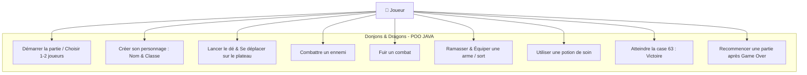

# POO_JAVA — Jeu de plateau Donjons & Dragons

Jeu de plateau textuel en Java, jouable à 1 ou 2 joueurs dans la console avec une **Interface Terminal Moderne (TUI / ANSI)** et une architecture orientée objet respectant strictement les principes **S.O.L.I.D.** et les **Design Patterns**.

Chaque joueur avance sur un plateau de 63 cases à coups de dé, ramasse des armes, des sorts et des potions, affronte les ennemis rencontrés (Goblins, Sorciers, Dragons) et tente d'atteindre la case 63 en restant en vie.

Projet réalisé dans le cadre du cours de Programmation Orientée Objet (POO).

---

## 🎨 Aperçu & Captures Terminal (Gameplay Preview)

### 1. Bannière d'Accueil & Menu Initial
```text
 ╔══════════════════════════════════════════════════════════════════════╗
 ║                                                                      ║
 ║   ██████╗  ██████╗  ██████╗     ██╗ █████╗ ██╗   ██╗ █████╗          ║
 ║   ██╔══██╗██╔═══██╗██╔═══██╗    ██║██╔══██╗██║   ██║██╔══██╗         ║
 ║   ██████╔╝██║   ██║██║   ██║    ██║███████║██║   ██║███████║         ║
 ║   ██╔═══╝ ██║   ██║██║   ██║██   ██║██╔══██║╚██╗ ██╔╝██╔══██║        ║
 ║   ██║     ╚██████╔╝╚██████╔╝╚█████╔╝██║  ██║ ╚████╔╝ ██║  ██║        ║
 ║   ╚═╝      ╚═════╝  ╚═════╝  ╚════╝ ╚═╝  ╚═╝  ╚═══╝  ╚═╝  ╚═╝        ║
 ║                                                                      ║
 ║             ⚔️  DONJONS & DRAGONS - EDITION CONSOLE  🧙              ║
 ║                                                                      ║
 ╚══════════════════════════════════════════════════════════════════════╝

👥 Combien de joueurs souhaitent jouer ? (1-2)
❯ 2
```

### 2. Vue du Plateau & Fiches de Statut
```text
┌─ ⚔️ TOUR DE ARTHUR (Guerrier)────────────────────────────────────────────┐
│ ❤️ Santé     : [████████] 10/10 HP  |  📍 Case : 14/63                   │
│ 🗡️ Équipé    : Épée (+5 dégâts)  (Base: 5)                                │
│ 🗡️ Armes/Sorts: [Massue]                                                   │
│ 🧪 Potions    : [Potion Standard] [Grande Potion]                          │
└──────────────────────────────────────────────────────────────────────────┘

🗺️  PLATEAU DE JEU (Case 1 à 63) :
 [01]    [02]    [03]    [04]    [05]    [06]    [07]    [08]    [09]    [10]   
[    ]  [🧪PT]  [🐉DR]  [    ]  [🗡️EP]  [👺GB]  [    ]  [🧙J2]  [🔮SO]  [✨FE] 

 [11]    [12]    [13]    [14]    [15]    [16]    ...
[    ]  [🧪PT]  [    ]  [⚔️J1]  [🔨MA]  [🐉DR]   ...
```

### 3. Choix d'Action du Joueur
```text
👉 C'est votre tour, Arthur !

🎯 Choisissez votre action :
  [1] 🎲 Lancer le dé
  [2] 🧪 Utiliser une potion de soin
  [3] 🗡️ Équiper une arme / sort
❯ 1
```

### 4. Carte d'Arène de Combat & Résolution des Dégâts
```text
⚔️ COMBAT ENGAGÉ ! ⚔️
Arthur le WARRIOR fait face à 🐉 Dragon !

┌─ ⚔️ ARENE DE COMBAT ⚔️ ──────────────────────────────────────────────────┐
│ Arthur (WARRIOR)                                                        │
│ ❤️ Santé   : [████████] 10/10 HP                                       │
│ 🗡️ Attaque : 10 dégâts (Épée (+5))                                      │
│                                                                         │
│ 🐉 Dragon                                                               │
│ ❤️ Santé   : [████████] 15/15 HP                                       │
│ 🗡️ Attaque : 4 dégâts                                                   │
└─────────────────────────────────────────────────────────────────────────┘

⚔️ Décision tactique :
  [1] ⚔️ Attaquer
  [2] 🏃 Fuir le combat
❯ 1

⚔️ Arthur attaque Dragon avec Épée !
💥 COUP CRITIQUE ! (+2 dégâts)
⚡ Dégâts infligés : 12 à Dragon
❤️ PV restant de Dragon : [█░░░░░░░] 3/15 HP
```

---

## 🏗️ Architecture & Respect des Principes S.O.L.I.D.

Le projet a été conçu selon les standards de la Clean Architecture :

- **S (Single Responsibility Principle)** : Séparation stricte entre les vues (`ConsoleTheme`, `BoardRenderer`, `MenuBattle`), le contrôleur de combat (`BattleManager`), la génération de carte (`GameBoard`) et l'orchestrateur (`Game`).
- **O (Open/Closed Principle)** : Utilisation du **Factory Method Pattern** pour l'instanciation des ennemis et équipements dans `GameBoard`.
- **L (Liskov Substitution Principle)** : Polymorphisme complet sur les sous-classes de `Character` (`Warrior`, `Wizard`), `Enemy` (`Goblin`, `Sorcerer`, `Dragon`) et `OffensiveEquipment`.
- **I (Interface Segregation Principle)** : Interface `Dice` ultra-ciblée avec sa méthode `roll()`.
- **D (Dependency Inversion Principle)** : Injection de dépendances (`Dice`, `MenuBattle`, `Menu`) dans `BattleManager`.

---

## 🗺️ Cas d'utilisation (Use Case UML)



---

## 📐 Diagramme de Classes (UML)

```mermaid
classDiagram
    direction TB

    class Entity {
        <<abstract>>
        #int id
        #String name
        #EntityType type
        #int pos
        #int lifePoints
        #int maxLifePoints
        #int strength
        +getHp() int
        +getMaxHp() int
        +setHp(int) void
        +getDmg() int
        +setDmg(int) void
    }

    class Character {
        <<abstract>>
        #int moveAvailable
        #List offEquipments
        #List defensiveEquipments
        #OffensiveEquipment currentOffEquip
        +canEquip(OffensiveEquipment) boolean
        +setCurrentOffEquip(OffensiveEquipment) int
        +useDefEquip(DefensiveEquipment) void
    }

    class Warrior {
        +Warrior(String, int)
        +canEquip(OffensiveEquipment) boolean
    }

    class Wizard {
        +Wizard(String, int)
        +canEquip(OffensiveEquipment) boolean
    }

    class Enemy {
        +Enemy(EntityType, String, int, int, int, int)
    }

    class Goblin {
        +Goblin(int)
    }

    class Sorcerer {
        +Sorcerer(int)
    }

    class Dragon {
        +Dragon(int)
    }

    class OffensiveEquipment {
        <<abstract>>
        #String name
        #int damage
        #OffEquipType type
        +getName() String
        +getDamage() int
        +getType() OffEquipType
    }

    class Weapon {
        <<abstract>>
    }

    class Spell {
        <<abstract>>
    }

    class Sword {
        +Sword()
    }

    class Mace {
        +Mace()
    }

    class FireBall {
        +FireBall()
    }

    class ThunderBolt {
        +ThunderBolt()
    }

    class DefensiveEquipment {
        <<abstract>>
        #String name
        #int hp
        +getName() String
        +getHp() int
    }

    class Potion {
        <<abstract>>
    }

    class PotionHP {
        +PotionHP()
    }

    class BigPotionHP {
        +BigPotionHP()
    }

    class Dice {
        <<interface>>
        +roll() int
    }

    class Dice6 {
        +roll() int
    }

    class Dice20 {
        +roll() int
    }

    class Game {
        -int currentPlayer
        -GameState gameState
        -GameBoard board
        -Menu menu
        -MenuBattle menuBattle
        -BattleManager battleManager
        +startGame() void
        +playTurn() void
        +manageBattle(Character) GameState
    }

    class Menu {
        +requestNbPlayer(int) int
        +chooseClass(int, int) int
        +requestName() String
        +requestPlayAgain() boolean
        +showGameOver() void
    }

    class ConsoleTheme {
        +getDisplayWidth(String) int
        +getHealthBar(int, int, int) String
        +printBanner() void
        +printBox(String, String...) void
    }

    Entity <|-- Character
    Entity <|-- Enemy
    Character <|-- Warrior
    Character <|-- Wizard
    Enemy <|-- Goblin
    Enemy <|-- Sorcerer
    Enemy <|-- Dragon

    OffensiveEquipment <|-- Weapon
    OffensiveEquipment <|-- Spell
    Weapon <|-- Sword
    Weapon <|-- Mace
    Spell <|-- FireBall
    Spell <|-- ThunderBolt

    DefensiveEquipment <|-- Potion
    Potion <|-- PotionHP
    Potion <|-- BigPotionHP

    Dice <|.. Dice6
    Dice <|.. Dice20

    Game *-- GameBoard
    Game *-- Menu
    Game *-- MenuBattle
    Game *-- BattleManager
    Menu ..> ConsoleTheme
    MenuBattle ..> ConsoleTheme
    BoardRenderer ..> ConsoleTheme
```



---

## 🛠️ Prérequis

- **JDK 17 ou supérieur** (ex: JDK 17 / JDK 21 / JDK 25).
- Aucune dépendance externe obligatoire pour jouer.

---

## 🚀 Lancer le jeu

### Depuis IntelliJ IDEA :
Ouvrir le projet et exécuter la classe `fr.campus.poojava.Main`.

### En ligne de commande (PowerShell / Terminal) :

Depuis la racine du projet :

```bash
# Compilation avec encodage UTF-8 vers out/production/POO_JAVA
javac --release 21 -encoding UTF-8 -d out/production/POO_JAVA (Get-ChildItem -Recurse -Filter *.java src).FullName

# Exécution de l'application avec support UTF-8
java -D"file.encoding=UTF-8" -cp out/production/POO_JAVA fr.campus.poojava.Main
```

---

## 📁 Structure du projet (Clean Architecture & Domain Packaging)

```
src/fr/campus/poojava/
├── Main.java                          Point d'entrée principal
├── db/
│   └── Database.java                  Persistance MySQL (via variables d'environnement)
├── entity/
│   ├── Entity.java                    Classe abstraite de base (id, name, type, hp, maxHp, dmg, pos)
│   ├── EntityType.java                Enum des types (WARRIOR, WIZARD, GOBLIN, SORCERER, DRAGON)
│   ├── character/
│   │   ├── Character.java             Classe abstraite du héros
│   │   ├── Warrior.java               Guerrier (PV:10, DMG:5)
│   │   └── Wizard.java                Mage (PV:7, DMG:7)
│   └── enemies/
│       ├── Enemy.java                 Classe de base des ennemis
│       ├── Goblin.java                Ennemi Goblin
│       ├── Sorcerer.java              Ennemi Sorcier (Sorcerer)
│       └── Dragon.java                Ennemi Dragon
├── equipment/
│   ├── defensive/
│   │   ├── DefensiveEquipment.java   Classe abstraite des équipements défensifs
│   │   ├── DefEquip.java              Enum des potions
│   │   └── potion/
│   │       ├── Potion.java            Classe abstraite des potions
│   │       ├── PotionHP.java          Potion standard (+2 HP)
│   │       └── BigPotionHP.java       Grande potion (+5 HP)
│   └── offensive/
│       ├── OffensiveEquipment.java   Classe abstraite des équipements offensifs
│       ├── OffEquip.java              Enum (SWORD, MACE, LIGHTNING, FIREBALL)
│       ├── OffEquipType.java          Enum (WEAPON, SPELL)
│       ├── spell/
│       │   ├── Spell.java             Classe abstraite des sorts
│       │   ├── FireBall.java          Sort Boule de Feu
│       │   └── ThunderBolt.java       Sort Éclair
│       └── weapon/
│           ├── Weapon.java            Classe abstraite des armes
│           ├── Mace.java              Massue
│           └── Sword.java             Épée
├── game/
│   ├── Game.java                      Boucle principale et machine à états
│   ├── GameState.java                 Enum des états du jeu
│   ├── board/
│   │   ├── GameBoard.java             Gestionnaire du plateau (Factory Pattern)
│   │   └── Cell.java                  Case du plateau
│   ├── battle/
│   │   ├── BattleManager.java         Gestionnaire des combats itératif (Injection de dépendances)
│   │   ├── BattleState.java           Enum des états de combat
│   │   └── Crit.java                  Enum des coups critiques
│   └── dice/
│       ├── Dice.java                  Interface des dés
│       ├── Dice6.java                 Dé 6 faces
│       └── Dice20.java                Dé 20 faces
└── ui/
    ├── ConsoleTheme.java              Thèmes ANSI, calculs de bordures Unicode & jauges de vie
    ├── Menu.java                      Entrées/sorties utilisateur, rejouabilité et inventaires
    ├── BoardRenderer.java             Rendu graphique du plateau console et fiches de statut
    └── MenuBattle.java                Cartes d'affrontement et bannières de combat
```

---

## 🌟 Points Forts du Projet

1. **Rendu Console ANSI avec Alignement Dynamique** : Bordures calculées dynamiquement sans décalage, jauges de santé dégradées.
2. **Architecture S.O.L.I.D. & Design Patterns** : Factory Method Pattern pour la création du plateau, Dependency Inversion pour les dés et menus de combat.
3. **Rejouabilité intégrée** : Possibilité de relancer instantanément une partie après une défaite (`requestPlayAgain`).
4. **Domain Packaging** : Découpe modulaire claire (`game.board`, `game.battle`, `ui`, `entity`).
5. **Code Source Maintenable (< 300 lignes par fichier)** : Lisibilité et maintenabilité maximales.
