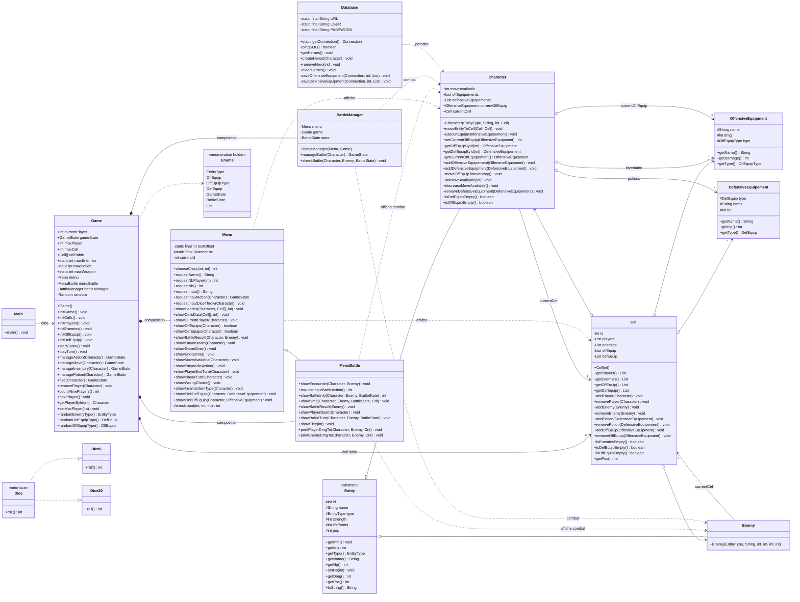
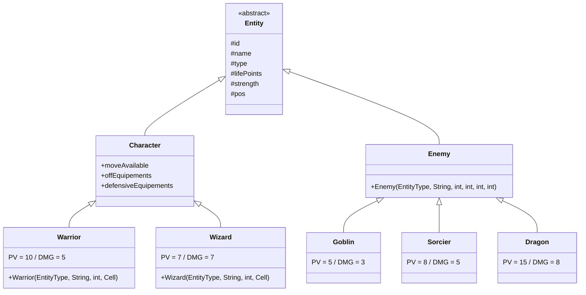
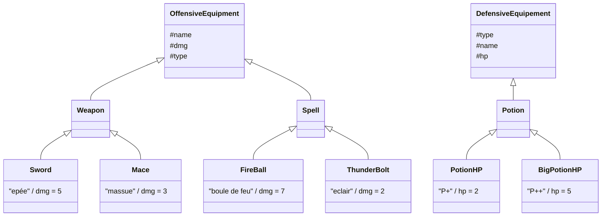

# POO_JAVA — Jeu de plateau

Jeu de plateau textuel en Java, jouable à 1 ou 2 joueurs dans la console.
Chaque joueur avance sur un plateau de 63 cases à coups de dé, ramasse de l'équipement,
affronte les ennemis rencontrés et tente d'atteindre la dernière case en restant en vie.

Projet réalisé dans le cadre du cours de Programmation Orientée Objet.

## Prérequis

- **JDK 25** — le projet utilise des fonctionnalités récentes du langage : méthode `main`
  d'instance (`void main()` sans `static` ni `String[] args`), `List.getFirst()` et les
  `case` d'énumération qualifiés (`case EntityType.Dragon:`).
- Aucune dépendance à installer pour jouer. Les jars présents dans `lib/`
  (MySQL Connector, protobuf) ne servent qu'à la persistance, désactivée par défaut.

## Lancer le jeu

Depuis IntelliJ IDEA : ouvrir le projet et exécuter `Main`.

En ligne de commande, depuis la racine du projet :

```bash
javac -encoding UTF-8 -d out $(find src -name "*.java")
java -Dstdout.encoding=UTF-8 -cp out fr.campus.poo_java.Main
```

Les deux options d'encodage sont nécessaires :

- `-encoding UTF-8` à la compilation, car le code contient des accents jusque dans les
  identifiants (`OffEquip.Epée`) ;
- `-Dstdout.encoding=UTF-8` à l'exécution, sans quoi les accents s'affichent en
  caractères parasites dans la console Windows (`D�placement`).

## Règles

- Plateau de **63 cases**. Tous les joueurs démarrent case 0 ; atteindre la dernière
  case met fin à la partie.
- **1 à 2 joueurs**, chacun choisit sa classe et son nom au lancement.
- À son tour, un joueur lance un dé (1 à 6) puis avance case par case, en validant
  chaque déplacement.
- Le plateau est garni aléatoirement à l'initialisation : **24 ennemis**,
  **16 équipements offensifs**, **8 potions**. Une case ne peut contenir qu'un seul
  de ces éléments.
- Marcher sur une case contenant un objet le ramasse automatiquement ; marcher sur un
  ennemi déclenche un combat.
- Un joueur dont les PV tombent à **0 ou moins meurt** : il est retiré du plateau et
  ne joue plus. Quand plus aucun joueur n'est en vie, la partie s'arrête.

### Classes jouables

| Classe   | PV | Force | Équipement utilisable |
|----------|----|-------|-----------------------|
| Guerrier | 10 | 5     | Armes                 |
| Mage     | 7  | 7     | Sorts                 |

Un Guerrier ne peut pas équiper un sort, et un Mage ne peut pas équiper une arme.
L'objet reste dans l'inventaire, mais son bonus de dégâts ne s'applique pas.

### Ennemis

| Ennemi  | PV | Dégâts |
|---------|----|--------|
| Goblin  | 5  | 3      |
| Sorcier | 8  | 5      |
| Dragon  | 15 | 8      |

### Équipements

| Objet                 | Type   | Effet     | Réservé à |
|-----------------------|--------|-----------|-----------|
| Épée                  | Arme   | +5 dégâts | Guerrier  |
| Massue                | Arme   | +3 dégâts | Guerrier  |
| Boule de feu          | Sort   | +7 dégâts | Mage      |
| Éclair                | Sort   | +2 dégâts | Mage      |
| Potion (`P+`)         | Potion | +2 PV     | —         |
| Grande potion (`P++`) | Potion | +5 PV     | —         |

## Commandes

Menu de début de tour :

| Touche | Action                                                      |
|--------|-------------------------------------------------------------|
| `1`    | Lancer le dé et commencer à se déplacer                     |
| `2`    | Boire une potion                                            |
| `3`    | Changer d'équipement offensif                               |
| `42`   | *(debug)* accorde 63 déplacements pour traverser le plateau |

Pendant un déplacement :

| Touche   | Action                                             |
|----------|----------------------------------------------------|
| `Entrée` | Avancer d'une case                                 |
| `1`      | Ouvrir l'inventaire pour changer d'arme ou de sort |

Pendant un combat :

| Touche | Action                      |
|--------|-----------------------------|
| `1`    | Attaquer                   |
| `2`    | Fuir (recule de 1 à 6 cases) |

## Déroulement d'un combat

1. Le joueur frappe en premier : dégâts = sa force + ceux de l'équipement équipé.
2. Si l'ennemi survit, il riposte, puis s'enfuit — la case est libérée dans tous les cas.
3. Si les PV du joueur tombent à 0 ou moins, il meurt : le message de décès s'affiche,
   il disparaît du plateau et le tour passe au joueur suivant encore en vie.
4. S'il ne reste plus aucun survivant, la partie se termine.
5. À tout moment pendant le combat, le joueur peut tenter de fuir en reculant de 1 à 6 cases.
   La fuite met fin au combat et libère la case.

## Lire le plateau

Le plateau est affiché sur une ligne, une paire de crochets par case :

```
[Ali][][Dra][][epé][P++][]
```

Chaque élément est abrégé à ses 3 premiers caractères : nom du joueur (`Ali`), type
d'ennemi (`Dra` pour Dragon), nom de l'équipement (`epé` pour épée), potion (`P+`, `P++`).
Une case vide reste `[]`.

## Structure du projet

```
src/fr/campus/poo_java/
├── Main.java                          Point d'entrée
├── Enums.java                         Types d'entités, d'équipements, états du jeu
├── game/
│   ├── Game.java                      Boucle de jeu, initialisation, gestion des tours
│   ├── BattleManager.java             Gestion des combats (dégâts, tours, fuite)
│   ├── Cell.java                      Une case et son contenu (joueurs, ennemis, objets)
│   ├── Dice.java                       Interface des dés
│   ├── Dice6.java                      Dé à 6 faces
│   └── Dice20.java                     Dé à 20 faces
├── ui/
│   ├── Menu.java                      Toutes les entrées/sorties console
│   └── MenuBattle.java                Affichage spécifique aux combats
├── entity/
│   ├── Entity.java                    Classe abstraite commune (id, name, type, PV, dégâts, position)
│   ├── Character.java                 Joueur : PV, force, inventaire, déplacement
│   ├── Enemy.java                     Classe de base des ennemis
│   ├── character/                     Warrior, Wizard
│   └── enemies/                       Goblin, Sorcier, Dragon
├── equipement/
│   ├── offensive_equipement/         Weapon (Sword, Mace), Spell (FireBall, ThunderBolt)
│   └── defensive_equipement/         Potion (PotionHP, BigPotionHP)
└── db/
    └── Database.java                  Persistance MySQL (non utilisée par le jeu)
```

La boucle de jeu est une machine à états (`GameState`) : `Idle` → `Moving` →
`InBattle` / `Inventory` / `Flee` → `End` → tour suivant, jusqu'à `Finish`.
Les combats utilisent eux-mêmes une machine à états (`BattleState`) : `PLAYER_TURN` ↔ `ENEMY_TURN`.

Le jeu implémente un système de dés extensible via l'interface `Dice` avec deux implémentations :
`Dice6` (dé standard à 6 faces) et `Dice20` (dé à 20 faces pour les jets critiques).
Les combats intègrent un système de coups critiques (`Crit`) : critique (+2 dégâts), échec critique (0 dégâts), ou normal.

## Diagramme de cas d'utilisation

```mermaid
useCaseDiagram
    actor Joueur
    actor Système

    Joueur --> (Lancer le jeu)
    Joueur --> (Choisir sa classe)
    Joueur --> (Choisir son nom)
    Joueur --> (Lancer le dé)
    Joueur --> (Se déplacer)
    Joueur --> (Ouvrir l'inventaire)
    Joueur --> (Boire une potion)
    Joueur --> (Changer d'équipement)
    Joueur --> (Attaquer)
    Joueur --> (Fuir le combat)

    Système --> (Initialiser le plateau)
    Système --> (Générer les ennemis)
    Système --> (Générer les équipements)
    Système --> (Gérer le tour de jeu)
    Système --> (Calculer les dégâts)
    Système --> (Appliquer les coups critiques)
    Système --> (Vérifier la fin de partie)

    (Lancer le jeu) .-> (Initialiser le plateau) : <<include>>
    (Lancer le jeu) .-> (Choisir sa classe) : <<include>>
    (Choisir sa classe) .-> (Choisir son nom) : <<include>>
    (Lancer le dé) .-> (Se déplacer) : <<include>>
    (Se déplacer) .-> (Gérer le tour de jeu) : <<include>>
    (Se déplacer) .-> (Attaquer) : <<include>> : si ennemi rencontré
    (Se déplacer) .-> (Ouvrir l'inventaire) : <<include>> : option pendant déplacement
    (Ouvrir l'inventaire) .-> (Boire une potion) : <<include>>
    (Ouvrir l'inventaire) .-> (Changer d'équipement) : <<include>>
    (Attaquer) .-> (Calculer les dégâts) : <<include>>
    (Attaquer) .-> (Appliquer les coups critiques) : <<include>>
    (Fuir le combat) .-> (Gérer le tour de jeu) : <<include>>
    (Calculer les dégâts) .-> (Vérifier la fin de partie) : <<include>>
```

## Diagramme de classes

### Vue d'ensemble



### Hiérarchie des entités



### Hiérarchie des équipements



`PotionHP` et `BigPotionHP` héritent de `Potion`, elle-même sous-classe de `DefensiveEquipement`.
La hiérarchie est donc similaire à celle des équipements offensifs (`Weapon` → `Sword`/`Mace`,
`Spell` → `FireBall`/`ThunderBolt`).

## Persistance MySQL (désactivée)

`Database.java` contient le code de sauvegarde des personnages, mais le jeu ne l'appelle
plus : il tourne sans aucune base de données. Le code de test correspondant est laissé en
commentaire dans `Main.java`.

Pour le réactiver :

1. Décommenter le bloc dans `Main.java` et/ou rappeler `db.createHeros(...)` dans
   `Game.initPlayers()`.
2. Ajouter `lib/mysql-connector-j-9.7.0.jar` au classpath.
3. Créer une base `game` contenant les tables `Characters`, `OffensiveEquipment` et
   `DefensiveEquipment`, puis adapter `URL` / `USER` / `PASSWORD` en tête de
   `Database.java`.

Les colonnes attendues, telles qu'utilisées par les requêtes : `Characters(Id, Type,
Name, LifePoints, Strength, pos, moveAvailable)` et `OffensiveEquipment(characterId,
name, damage)`.

## Limites connues

- `Menu.chooseClass()` borne le choix de la classe par le nombre de joueurs : en partie
  à un joueur, seul « Guerrier » est acceptable.
- `Potion`, `Spell` et `Weapon` sont des classes intermédiaires vides, et
  `Database.saveDefensiveEquipment()` n'est pas implémentée.
- Les classes `Character` et `Enemy` partagent désormais une classe parente abstraite `Entity`,
  ce qui élimine la duplication des attributs (`id`, `name`, `type`, `strength`, `lifePoints`, `pos`)
  et de leurs accesseurs.
- Les identifiants MySQL sont écrits en dur dans `Database.java` ; à externaliser avant
  toute diffusion publique du dépôt.
